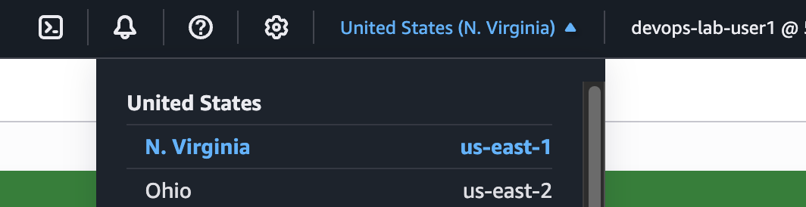
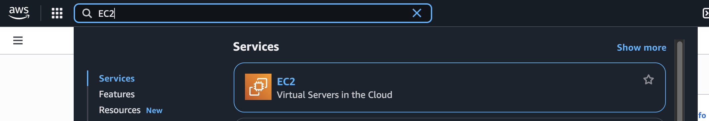
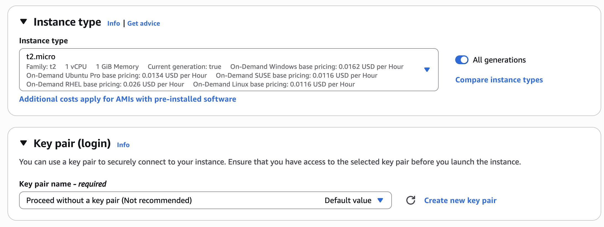
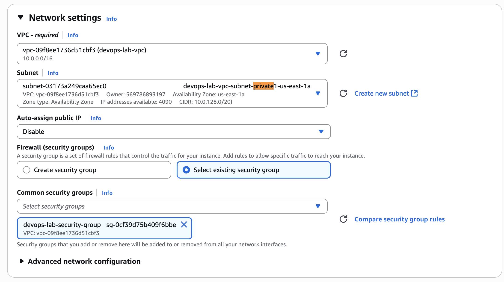
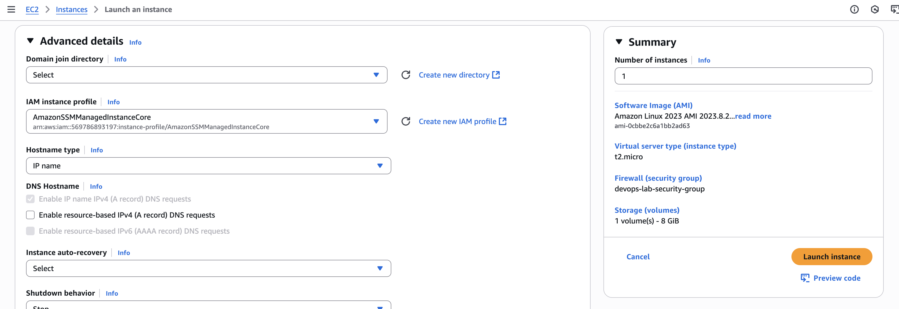
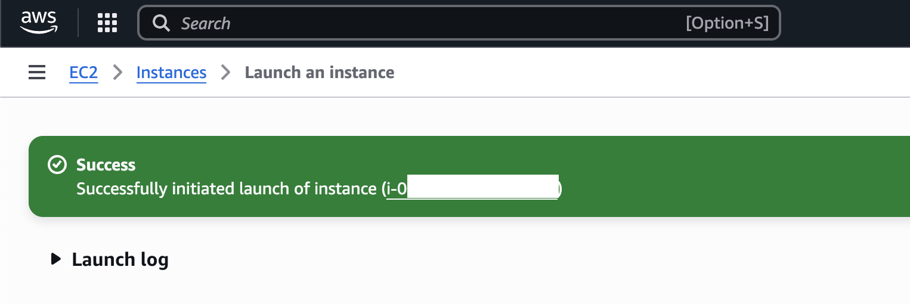
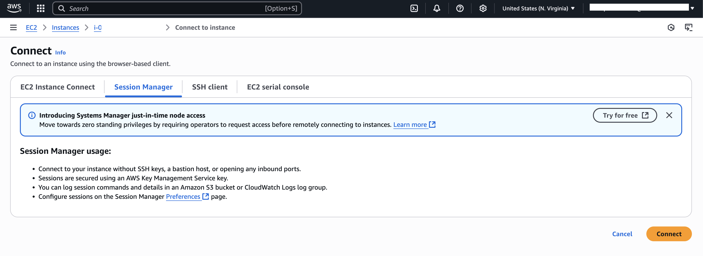
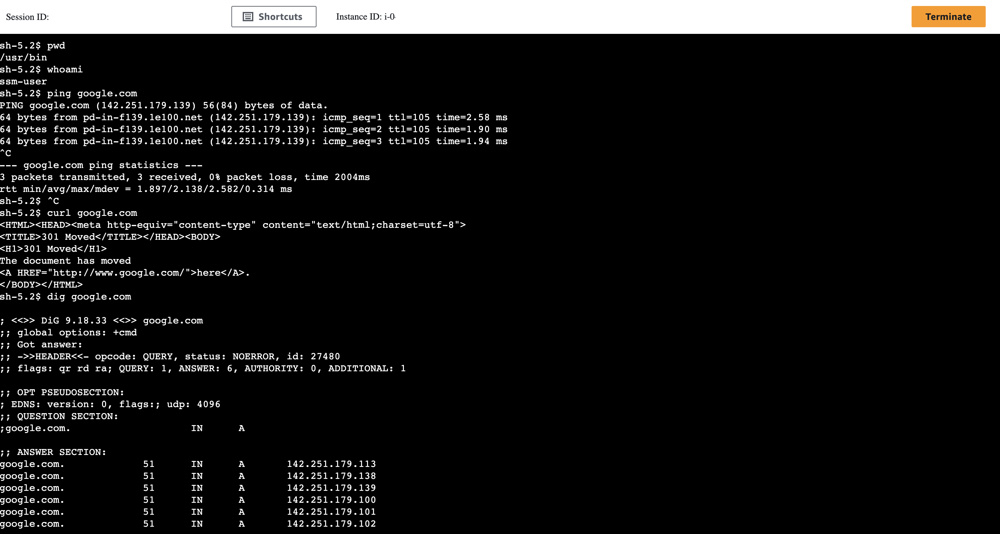
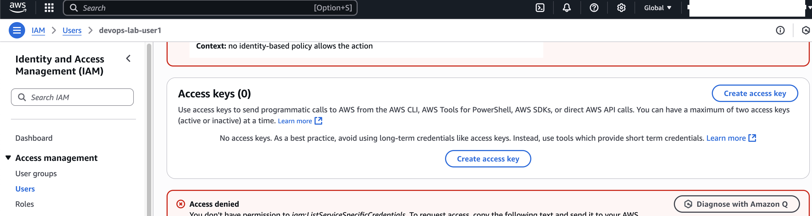
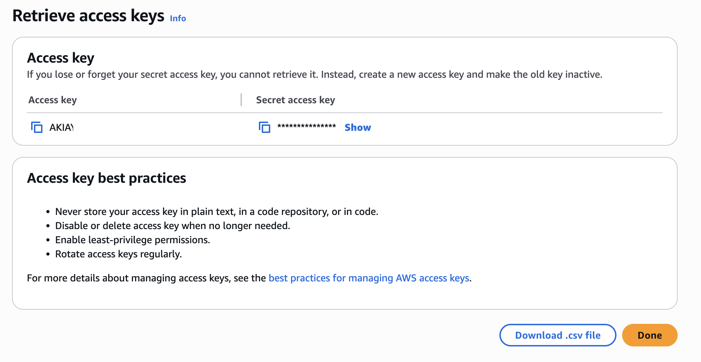

# Lab 3: AWS EC2, IAM, S3

In this lab, you will learn how to:

- create EC2 machine
- use EC2 machine
- terminate EC2 machine
- setup AWS CLI locally with your own keys
- upload files to S3 buckets


## Task - Part 1 (Launch EC2 Machine)

1. Login to AWS Console using url, username and password with provided credentials
2. Verify region switched to us-east-1 N. Virginia (top-right dropdown)



3. Search for "EC2" in top-left search bar




4. Open [EC2 Service](https://us-east-1.console.aws.amazon.com/ec2/home?region=us-east-1#Home:)
5. Click "Launch instance" (orange button)
6. Enter name "devops-lab-machine<your number>". (Example: `devops-lab-machine10`)
7. Keep "Application and OS Images (Amazon Machine Image)" settings to defaults
8. Change "Instance Type" to `t2.micro` (other types won't work)
9. Change "Key Pair" to `Proceed without keypair (Not recommended)`



10. Change "Network settings" to the following:

- Network: "vpc-09f8ee1736d51cbf3 | devops-lab-vpc"
- Subnet: any private subnet (example: `subnet-03173a249caa65ec0 | devops-lab-vpc-subnet-private1-us-east-1a`)
- Auto-assign public IP: Disabled
- Firewall (security groups): `Select security group` -> `devops-lab-security-group`



11. Keep "Configure storage" settings to defaults
12. Expand "Advanced Settings"
13. Set "IAM instance profile" to `AmazonSSMManagedInstanceCore`



14. Click "Launch instance" (right side-bar)
15. Confirm that you can see the following message:

```
Success
Successfully initiated launch of instance (i-0xxxxxxxxx)
```

[!!!] Save EC2 instance ID somewhere (looks like this: `i-0xxxxxxxxx`)



## Task - Part 2 (Connect to EC2 machine)

16. Open the instance page by clicking on ID: i-0xxxxxxxxx
17. Wait until EC2 is online (status: Running)
18. Click on "Connect"
19. Open "Session Manager" tab

[!!!] If page says "Instance is not connected to Session Manager", reload page in 1-2 minutes

20. Click "Connect" (orange button) on the bottom-right



21. Once session is opened, try a couple of basic commands:

- `pwd` -> get current folder
- `whoami` -> get current username
- `ping google.com` -> ping public website (Ctrl+C / CMD+C to exit)
- `curl google.com` -> get HTML page for public website
- `dig google.com` -> run DNS lookup for public website


22. Run AWS command to get current identity:

```

> aws sts get-caller-identity

{
    "UserId": "[REDACTED]:i-0xxxxxxxxxxx",
    "Account": "[REDACTED]",
    "Arn": "arn:aws:sts::[REDACTED]:assumed-role/AmazonSSMManagedInstanceCore/i-0xxxxxxxxxxx"
}
```

[!!!] Save EC2 instance ID somewhere (looks like this: `i-0xxxxxxxxx`)




## Task - Part 3 (Setup your local environment with AWS CLI)


[!!!] Before proceeding to this task, please install AWS CLI on your local machine / terminal
Instruction: https://docs.aws.amazon.com/cli/latest/userguide/getting-started-install.html


23. Search for `IAM` in the top-left search bar
24. Open "IAM" Service
25. Open "Users" tab
26. Locate your user "devops-lab-user<number>" -> open it
27. Open tab "Security Credentials"
28. Scroll down to "Access keys"
29. Click on "Create access key"



30. Choose "Command Line Interface (CLI)"
31. Toggle checkbox "I understand the above recommendation and want to proceed to create an access key."
32. Keep description empty, continue
33. Confirm that key successfully created
34. Click "Download .csv file"



35. Open CSV file with your credentials
36. Open Terminal
37. Run command `aws sts get-caller-identity`  -> verify that some error returned (NotFound or ExpiredToken). No identity returned
38. Run `aws configure`
39. When asked AWS Access Key ID, enter value from CSV file -> `Access key ID` and Press Enter
39. When asked AWS Secret Access Key, enter value from CSV file -> `Secret access key`. Press Enter.
40. When asked Default region name, enter `us-east-1`. Press Enter.
41. For other questions, press Enter.
42. Now retry step 37 and verify JSON with your User returned

```
> aws sts get-caller-identity

{
    "UserId": "[REDACTED]",
    "Account": "[REDACTED]",
    "Arn": "arn:aws:iam::[REDACTED]:user/devops-lab-user<number>"
}
```

[!!!] Congratulations! Now you can perform any operations from your local machine!. Let's try stopping EC2 machine

43. Run the following command to stop your EC2 machine

```
> aws ec2 stop-instances --instance-ids i-0xxxxxxxxxxx 
{
    "StoppingInstances": [
        {
            "CurrentState": {
                "Code": 64,
                "Name": "stopping"
            },
            "InstanceId": "i-0xxxxxxxxxxx",
            "PreviousState": {
                "Code": 16,
                "Name": "running"
            }
        }
    ]
}
```

## Task - Part 4 (Upload files to S3 bucket)

TODO

44. Open your current folder using `open .` command
45. Copy your own HTML file from Lab 1 (or create text file with any content like "Hello world") to opened folder
46. Now upload this file to S3 bucket:

```
> aws s3 cp bcvry9.txt s3://devops-lab-private/
upload: ./bcvry9.txt to s3://devops-lab-private/bcvry9.txt      
```

47. Verify that object is now uplaoded:

- Open [devops-lab-private S3 bucket](https://us-east-1.console.aws.amazon.com/s3/buckets/devops-lab-private?region=us-east-1&bucketType=general&tab=objects)

48. Click "Open" on your objects. Make sure content is visible in your browser.
49. Delete file from S3 bucket using UI or cli (bonus point for finding delete command!)


Done!